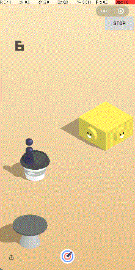

# 微信跳一跳辅助服务器
使用PyAndroidControl构建的微信跳一跳自动通关服务器。可以在Android手机上实现自动玩跳一跳的功能，而无需链接数据线。

## 使用方法
1. 安装 [PyAndroidControl](https://github.com/nladuo/PyAndroidControl) 。
2. 打开 `PyAndroidControl APP`，授予悬浮窗权限、文件读写权限和ROOT权限，并且在文本框内输入： `http://120.27.241.203:6777`，点击按钮，开始服务。
3. 进入跳一跳小程序，点击 `START` 按钮，开始自动玩游戏。

## 注意事项
- 本服务有一定的失败概率，并且可能会被微信检测到异常，仅供学习交流使用。
- 本人的服务器随时可能停止提供服务，为了您的使用体验，建议您将代码clone至您本人的服务器上运行。
